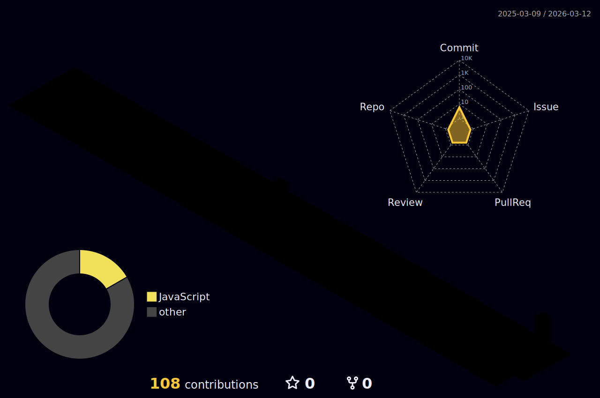

<h1 align="center">Hi, I'm Andrey Perestyuk</h1>

  

  
  

---

### 🧑‍💻 About me

- Backend developer with experience in **Magento 2**, **Python**, **JavaScript**, **Java/Spring Boot**
- Building ML-powered recommendation systems with **FastAPI**, **scikit-learn**, **MLflow**
- DevOps enthusiast: **Docker Swarm**, **GitLab CI/CD**, **OpenTelemetry**
- Interested in graphics programming, Linux ricing, and system automation
- Arctic Code Vault Contributor

---

### 🛠 Tech Stack

  
  
  
  
  
  
  
  
  

  
  
  
  
  
  

  
  
  
  

  
  
  
  
  

---

### 🔥 Streak

  

---

### 📈 Activity Graph

  

---

### 🌆 3D Contribution Graph

  

---

  

